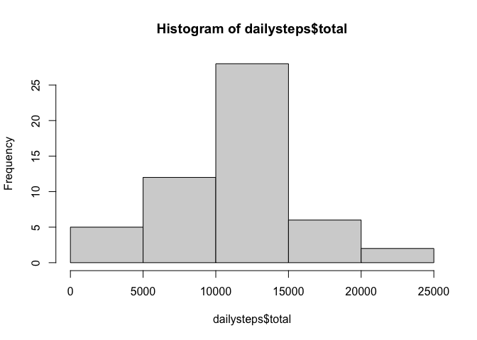
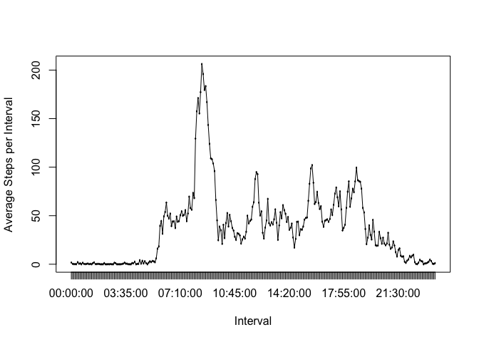
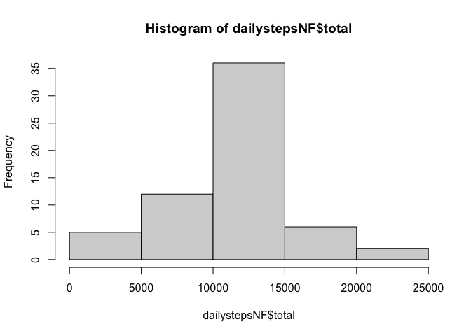
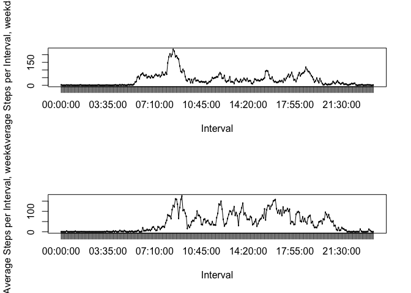

Latest personal movement monitoring devices are being used by people in an effort to improve their health.  Nevertheless, once data is collected is difficult to process and interpret it due to the scarce existence of statistical methods and processing / interpreting software.  
The present document describes the path to begin analyzing this type of data produced by one individual every 5 minutes each day of October and November of year 2012. It comprises the number of steps taken in each mentioned period.

## Loading and preprocessing the data

Data was downloaded from [Acitvity monitoring data](https://d396qusza40orc.cloudfront.net/repdata%2Fdata%2Factivity.zip) . It is basically a 3 column data set describing the date, 5 minute interval, and steps taken in this interval for 17,568 observations. It is a CSV, comma separated file, containing header. The code used to download it is the following, The packages utilized to process data and produce plots are dplyr and lubridate. The initial processing modifies the data and interval columns to be manageable with the code, please view here chunk named Rdat.R:

```r
# read data
fileURL <- "https://d396qusza40orc.cloudfront.net/repdata%2Fdata%2Factivity.zip"
download.file(fileURL, 
              destfile = "./repdata%2Fdata%2Factivity.zip", method = "curl")
unzip("./repdata%2Fdata%2Factivity.zip")
Factivity <- read.csv("./activity.csv", header = T, sep = ",")

library(dplyr)
```

```
## 
## Attaching package: 'dplyr'
```

```
## The following objects are masked from 'package:stats':
## 
##     filter, lag
```

```
## The following objects are masked from 'package:base':
## 
##     intersect, setdiff, setequal, union
```

```r
library(lubridate)
```

```
## 
## Attaching package: 'lubridate'
```

```
## The following objects are masked from 'package:base':
## 
##     date, intersect, setdiff, union
```

```r
by_day <- Factivity %>% mutate(date = as.Date(date, "%Y-%m-%d")) %>%group_by(date)
by_day$interval <- gsub("00$", ":00:00", by_day$interval)
by_day$interval <- gsub("05$", ":05:00", by_day$interval)
by_day$interval <- gsub("10$", ":10:00", by_day$interval)
by_day$interval <- gsub("^0", "00:00:00", by_day$interval)
by_day$interval <- gsub("15$", ":15:00", by_day$interval)
by_day$interval <- gsub("20$", ":20:00", by_day$interval)
by_day$interval <- gsub("25$", ":25:00", by_day$interval)
by_day$interval <- gsub("30$", ":30:00", by_day$interval)
by_day$interval <- gsub("35$", ":35:00", by_day$interval)
by_day$interval <- gsub("40$", ":40:00", by_day$interval)
by_day$interval <- gsub("45$", ":45:00", by_day$interval)
by_day$interval <- gsub("50$", ":50:00", by_day$interval)
by_day$interval <- gsub("55$", ":55:00", by_day$interval)
by_day$interval <- gsub("5$", "00:05:00", by_day$interval)
by_day$interval <- gsub("^:", "00:", by_day$interval)
by_day$interval <- gsub("^1:", "01:", by_day$interval)
by_day$interval <- gsub("^2:", "02:", by_day$interval)
by_day$interval <- gsub("^3:", "03:", by_day$interval)
by_day$interval <- gsub("^4:", "04:", by_day$interval)
by_day$interval <- gsub("^5:", "05:", by_day$interval)
by_day$interval <- gsub("^6:", "06:", by_day$interval)
by_day$interval <- gsub("^7:", "07:", by_day$interval)
by_day$interval <- gsub("^8:", "08:", by_day$interval)
by_day$interval <- gsub("^9:", "09:", by_day$interval)
```

## What is mean total number of steps taken per day?

The chunk StpsDay.R throws a histogram of the total steps taken in each day, as well as its mean and meadian values.

```r
# histogram of daily steps
dailysteps <- by_day %>% summarise(total = sum(steps), mean = mean(steps),
                                   median = median(steps))
```

```
## `summarise()` ungrouping output (override with `.groups` argument)
```

```r
hist(dailysteps$total)
```

<!-- -->

```r
dev.copy(png, file = "hist_dailysteps_total.png")
```

```
## quartz_off_screen 
##                 3
```

```r
dev.off()
```

```
## quartz_off_screen 
##                 2
```

```r
# mean of daily steps
stepsmean <- dailysteps$mean
print(stepsmean)
```

```
##  [1]         NA  0.4375000 39.4166667 42.0694444 46.1597222 53.5416667
##  [7] 38.2465278         NA 44.4826389 34.3750000 35.7777778 60.3541667
## [13] 43.1458333 52.4236111 35.2048611 52.3750000 46.7083333 34.9166667
## [19] 41.0729167 36.0937500 30.6284722 46.7361111 30.9652778 29.0104167
## [25]  8.6527778 23.5347222 35.1354167 39.7847222 17.4236111 34.0937500
## [31] 53.5208333         NA 36.8055556 36.7048611         NA 36.2465278
## [37] 28.9375000 44.7326389 11.1770833         NA         NA 43.7777778
## [43] 37.3784722 25.4722222         NA  0.1423611 18.8923611 49.7881944
## [49] 52.4652778 30.6979167 15.5277778 44.3993056 70.9270833 73.5902778
## [55] 50.2708333 41.0902778 38.7569444 47.3819444 35.3576389 24.4687500
## [61]         NA
```

```r
# median of daily steps
stepsmedian <- dailysteps$median
print(stepsmedian)
```

```
##  [1] NA  0  0  0  0  0  0 NA  0  0  0  0  0  0  0  0  0  0  0  0  0  0  0  0  0
## [26]  0  0  0  0  0  0 NA  0  0 NA  0  0  0  0 NA NA  0  0  0 NA  0  0  0  0  0
## [51]  0  0  0  0  0  0  0  0  0  0 NA
```

## What is the average daily activity pattern?

The chunk ActPatt.R contains code that plots the average steps per interval and prints out the maximum inteval value, 8:35.

```r
# average steps by 5 min interval
intervalsteps <- by_day %>% 
        mutate(interval = as.factor(interval)) %>%
        group_by(interval) %>% mutate(date, interval, 
                                      mean = mean(steps, na.rm = T)) %>%
        filter(date == "2012-10-01")

# plot
plot(intervalsteps$interval, intervalsteps$mean, type = "l", xlab = "Interval", 
     ylab = paste("Average Steps per Interval"))
lines(intervalsteps$interval, intervalsteps$mean, type = "l", xlab = "Interval", 
      ylab = paste("Average Steps per Interval"))
```

<!-- -->

```r
#save plot
dev.copy(png, file = "AvgStpIntvl.png")
```

```
## quartz_off_screen 
##                 3
```

```r
dev.off()
```

```
## quartz_off_screen 
##                 2
```

```r
#  5-minute interval, on average across all the days in the dataset, contains 
#  the maximum number of steps
max_step_int <- intervalsteps[which.max(intervalsteps$mean), 3]
print(max_step_int)
```

```
## # A tibble: 1 x 1
## # Groups:   interval [1]
##   interval
##   <fct>   
## 1 08:35:00
```

## Imputing missing values

The chunl FilledNAs.R presents the processing of the data to throw the total number of NAs, then code for the fill in for this missing values with the interval average and then gives the mean and median values for the total number of steps per day. In comparison with the raw data including NAs it can be observed that there is a proportional increment in all bars of the histogram.

```r
# calculate number of NAs
NAs <- by_day %>% filter(is.na(steps))
nrow(NAs)
```

```
## [1] 2304
```

```r
# fill in NAs in steps
NAsFilled <- by_day %>% 
        mutate(interval = as.factor(interval)) %>%
        group_by(interval) %>% mutate(date, interval, 
                                      mean = mean(steps, na.rm = T))
NAsFilled$steps <- coalesce(NAsFilled$steps, NAsFilled$mean)

# histogram of total steps per day
dailystepsNF <- NAsFilled %>% ungroup(interval) %>% group_by(date) %>%
        summarise(total = sum(steps), mean = mean(steps), median = median(steps))
```

```
## `summarise()` ungrouping output (override with `.groups` argument)
```

```r
hist(dailystepsNF$total)
```

<!-- -->

```r
dev.copy(png, file = "hist_dailysteps_total_NAsFilled.png")
```

```
## quartz_off_screen 
##                 3
```

```r
dev.off()
```

```
## quartz_off_screen 
##                 2
```

```r
# mean of total steps per day
stepsmean <- dailystepsNF$mean
print(stepsmean)
```

```
##  [1] 37.3825996  0.4375000 39.4166667 42.0694444 46.1597222 53.5416667
##  [7] 38.2465278 37.3825996 44.4826389 34.3750000 35.7777778 60.3541667
## [13] 43.1458333 52.4236111 35.2048611 52.3750000 46.7083333 34.9166667
## [19] 41.0729167 36.0937500 30.6284722 46.7361111 30.9652778 29.0104167
## [25]  8.6527778 23.5347222 35.1354167 39.7847222 17.4236111 34.0937500
## [31] 53.5208333 37.3825996 36.8055556 36.7048611 37.3825996 36.2465278
## [37] 28.9375000 44.7326389 11.1770833 37.3825996 37.3825996 43.7777778
## [43] 37.3784722 25.4722222 37.3825996  0.1423611 18.8923611 49.7881944
## [49] 52.4652778 30.6979167 15.5277778 44.3993056 70.9270833 73.5902778
## [55] 50.2708333 41.0902778 38.7569444 47.3819444 35.3576389 24.4687500
## [61] 37.3825996
```

```r
# median of daily steps
stepsmedian <- dailystepsNF$median
print(stepsmedian)
```

```
##  [1] 34.11321  0.00000  0.00000  0.00000  0.00000  0.00000  0.00000 34.11321
##  [9]  0.00000  0.00000  0.00000  0.00000  0.00000  0.00000  0.00000  0.00000
## [17]  0.00000  0.00000  0.00000  0.00000  0.00000  0.00000  0.00000  0.00000
## [25]  0.00000  0.00000  0.00000  0.00000  0.00000  0.00000  0.00000 34.11321
## [33]  0.00000  0.00000 34.11321  0.00000  0.00000  0.00000  0.00000 34.11321
## [41] 34.11321  0.00000  0.00000  0.00000 34.11321  0.00000  0.00000  0.00000
## [49]  0.00000  0.00000  0.00000  0.00000  0.00000  0.00000  0.00000  0.00000
## [57]  0.00000  0.00000  0.00000  0.00000 34.11321
```

## Are there differences in activity patterns between weekdays and weekends?

The chunk WdayPatt.R shows the processing of the data to produce a plot showing the difference between weekday and weekend pattern.  It looks like if during the week the larger amount of steps is in the morning when everyone goes to work, then there are smaller peaks at different lunch times and different end of office hours.  During the weekend, there is also a peak in the early morning but there are also several similar ones around noon and in the afternoon, it looks like people use the weekends to exercise more during the day.

```r
# separate dailystepsNF into weekdays and weekend
wdays <- by_day %>% mutate(Wd = as.factor(weekdays(date)), interval = as.factor(interval)) %>% 
             filter(Wd == "Monday" | Wd == "Tuesday" | Wd == "Wednesday" | 
                    Wd == "Thursday" | Wd == "Friday") %>% group_by(interval) %>% 
             mutate(mean = mean(steps, na.rm = T), f = as.factor("weekday")) %>%
             filter(date == "2012-10-01")
wdays$steps <- coalesce(wdays$steps, wdays$mean)
wend <- by_day %>% mutate(Wd = as.factor(weekdays(date)), interval = as.factor(interval)) %>% 
            filter(Wd == "Saturday" | Wd == "Sunday") %>% group_by(interval) %>% 
            mutate(mean = mean(steps, na.rm = T), f = as.factor("weekend")) %>%
            filter(date == "2012-10-06")
wend$steps <- coalesce(wend$steps, wend$mean)

# plot
par(mfrow = c(2, 1))
plot(wdays$interval, wdays$mean, type = "l", xlab = "Interval", 
     ylab = paste("Average Steps per Interval, weekdays"))
lines(wdays$interval, wdays$mean, type = "l", xlab = "Interval", 
      ylab = paste("Average Steps per Interval, weekdays"))
plot(wend$interval, wend$mean, type = "l", xlab = "Interval", 
     ylab = paste("Average Steps per Interval, weekend"))
lines(wend$interval, wend$mean, type = "l", xlab = "Interval", 
      ylab = paste("Average Steps per Interval, weekend"))
```

<!-- -->

```r
#save plot
dev.copy(png, file = "AvgStpIntvl_WdayPatt.png")
```

```
## quartz_off_screen 
##                 3
```

```r
dev.off()
```

```
## quartz_off_screen 
##                 2
```
